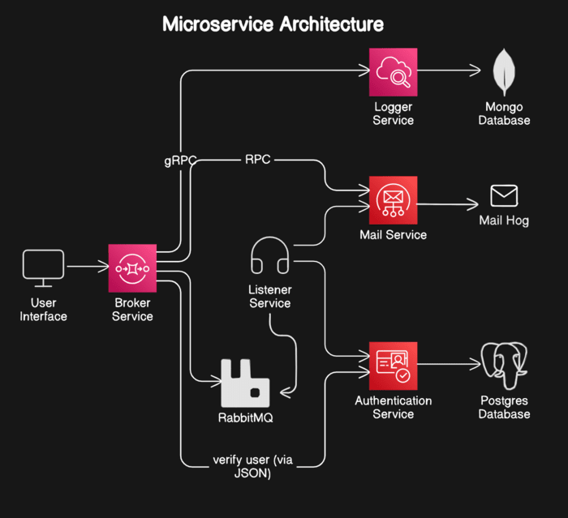

# Basic Microservice in Go

This project is meant for learning experience to understand, basic microservices architecture built using Go. The system consists of multiple interconnected services responsible for handling different functionalities.


## Architecture

The diagram illustrates the core components of the system:





1. User Interface: The entry point for user interactions.
2. Broker Service: Handles message queuing and distribution.
3. Listener Service: Consumes messages from the broker and processes them.
4. Authentication Service: Verifies user credentials and provides authentication tokens.
5. Mail Service: Manages email-related functionalities.
6. Logger Service: Logs application events and errors.
7. Data Storage: Utilizes MongoDB and PostgreSQL for data persistence.
8. Message Broker: Employs RabbitMQ for asynchronous communication.
## Tech Stack

1. **Go** 
2. **Docker** 
3. **PostgreSQL**
4. **MongoDB**
5. **RabbitMQ**


## Deployment


To deploy this project locally

```bash
  make up_build //starts the docker container
  make start //runs the front-end at port 80
```

To stop it 

```bash
make down //stops the docker containers
make stop //stops the front-end
```

I've included every command needed in the ./scripts/Makefile 


## Running Tests

I've yet to write unit tests, will update soon..


